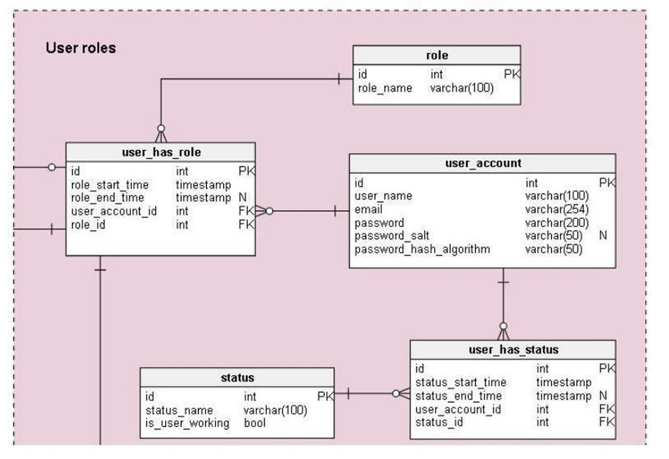

## RELATIONAL-DATABASE-DESIGN-SQL

#### PROJECT SUMMARY :- 

The Project Aims To Convert A Relational Design Into SQL Server Tables Effectively. This Involves Defining Appropriate Tables, Establishing Relationships Between Them Using Foreign Keys, And Populating Them With Sample Data.

#### TOPICS :-
In This Project, The Focus Is On Designing Tables In SQL Server That Reflect A Relational Model Consisting Of Users, Roles, User Accounts, And Their Statuses. The Implementation Includes Creating Tables, Defining Primary And Foreign Keys, And Inserting Data To Demonstrate Functionality.

                                                                          

#### TASKS TO BE PERFORMED :-
#### 1. DEFINE RELATIONS/ATTRIBUTES :-
   - Identify And Define The Entities And Their Attributes (Fields) Based On The Relational Design.
  
#### 2. DEFINE PRIMARY KEYS :-
   - Determine Primary Keys For Each Table To Uniquely Identify Records.
  
#### 3. CREATE FOREIGN KEYS :-
   - Establish Relationships Between Tables By Creating Foreign Keys That Reference Primary Keys Of Related Tables.
  
#### 4. INSERT DATA INTO TABLES :-
   - Populate Each Table With At Least Two Rows Of Sample Data.
   - Ensure Foreign Key Constraints Are Respected During Data Insertion.
  
#### 5. DELETE ALL DATA FROM TABLES :-
   - Implement Functionality To Delete All Data From Each Table, Ensuring Referential Integrity Is Maintained.

 

### EXPLANATION :-
- USERS TABLE :- Stores Basic Information About Users Such As UserID, Username, And Email.
- ROLES TABLE :- Contains Different Roles That Users Can Have, Identified By RoleID And Rolename.
- USER_ACCOUNTS TABLE :- Represents User Accounts With Attributes Like AccountID, UserID (Foreign Key To Users Table), Username, And Password.
- USER_HAS_ROLE TABLE :- Facilitates The Many-to-many Relationship Between Users And Roles Using UserID And RoleID As Foreign Keys.
- STATUS TABLE :- Stores Various Statuses With StatusID And Statusname.
- USER_HAS_STATUS TABLE :- Establishes The Relationship Between Users And Their Statuses Using UserIDAnd StatusID As Foreign Keys.

These Table Definitions Cover The Entities Provided, Establishing The Necessary Attributes And Relationships To Model Their Interactions In A Relational Database. Adjustments Can Be Made Based On Specific Requirements Or Additional Attributes That May Be Needed.

### PROJECT DELIVERABLES :-
- SQL Scripts Containing Table Definitions, Primary Key Constraints, Foreign Key Constraints, And Data Insertion Statements.
- Documentation Explaining The Table Structure, Key Constraints, And A Brief Overview Of The Project.

### OUTCOME :-
Upon Completion, The Project Will Have Transformed The Conceptual Relational Design Into A Practical SQL Server Database Schema. It Will Demonstrate Proficiency In Database Design Principles Including Entity Identification, Attribute Definition, Primary Key Assignment, And Establishment Of Relationships Through Foreign Keys.
